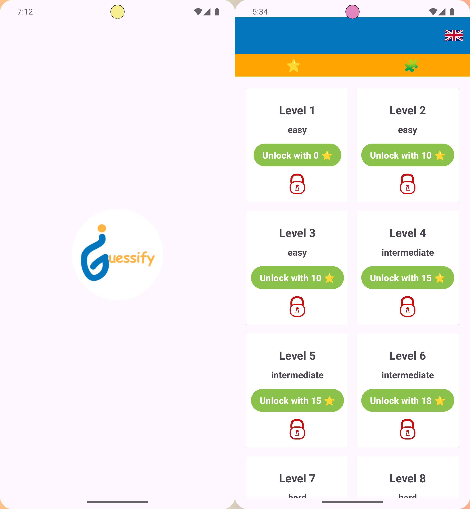
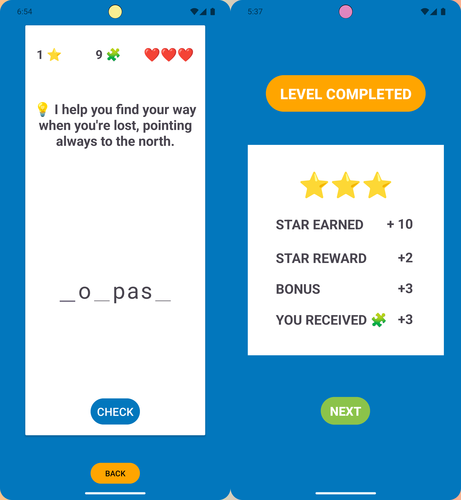

## 🎮 Guessify - Word Guessing Game

**Guessify** is a vocabulary-based word guessing game where players fill in missing letters using context clues.

Crafted in Java. Powered by LiveData. Driven by curiosity. 🚗

It’s a passion project by a beginner Java learner—designed to be both fun and educational.

  

  

## ⚙️ Features

🔡 **Masked Word Generation:** 
Letters are randomly hidden depending on difficulty.

💬 **Contextual Hints:** 
Clues like definitions or synonyms help guide each guess.

📲 **Dynamic UI Creation:** 
UI is built programmatically with EditTexts/TextViews—no XML layouts.

🔁 **Reactive State with LiveData:** 
Game state updates (like star count and help items) are observed and reflected in real-time.

🧠 **Auto Input Navigation:**
Cursor jumps forward/backward as users type or delete, improving the flow.

🧩 **Hint Reveal System:** 
Reveal missing letters with smart UI feedback.

📊 **Levels with Unlockable Difficulty:** 
Complete levels to unlock new stages with increasing challenge.

🗃️ **Progress Saved via Room DB:** 
Stars earned per level are saved in a local database and used to unlock new levels.

  
 

## 🧪 Tech & Concepts Used 

**Java**	Game core logic and UI development

**Android SDK**	Native components like Activities, Fragments, and Intents

**LiveData**	Observing state for UI reactivity

**Room DB**	Persisting stars, hints, and unlocked levels

**TextWatchers**	Intelligent input handling

**LinearLayout**	Custom view containers for game words

## 🔧 Architecture

**Guessify** separates UI from logic for clarity and reusability:

**GuessingWord** handles word masking and validation.

**Room DB** stores stars, hints, and unlocked levels.

**Activities** observe LiveData and reflect changes in the UI.

🛠️ All architecture decisions—including class structure, data flow, and screen logic—were designed independently as part of my learning journey.
The goal was to apply real software thinking from the start—even as a beginner.

## 🎯 Why I Built It

I wanted to learn Android the real way—by building something fun and useful. Guessify helped me explore:

**State management** with LiveData

**Data persistence** with Room Database

Creating **dynamic views** in Java

**Separating game logic** for testability and reusability

## 🚀 Future Plans

🌍 Multi-language support (German, Thai, more)

⭐ Reward exchange system using collected stars

📈 Score dashboard

🎨 Theme selector or dark mode

## 🐣 Developer’s Note

Still learning. Still guessing. Still building.
Still catching bugs 🪲🕸️ — can you find them too?

Let’s see how far we can go. 🌱
